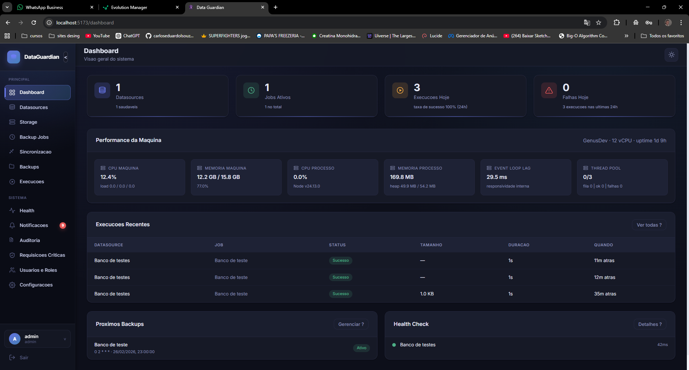
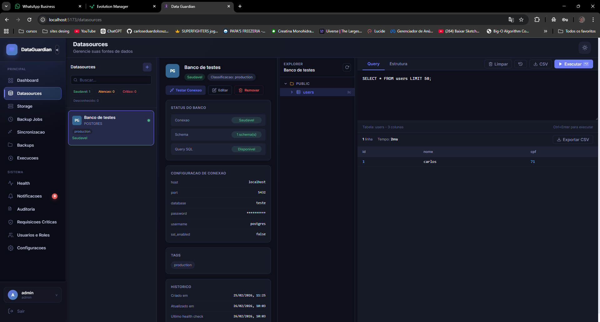
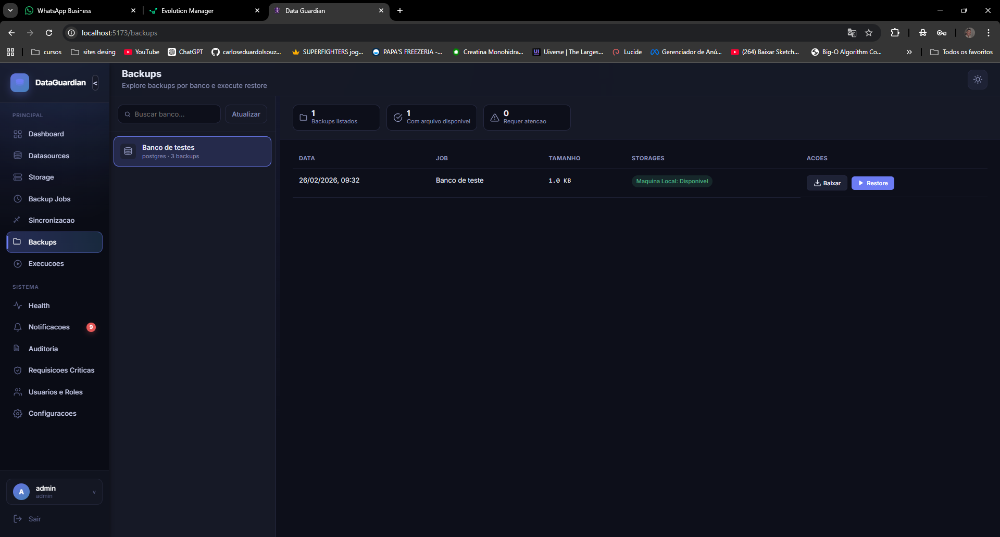
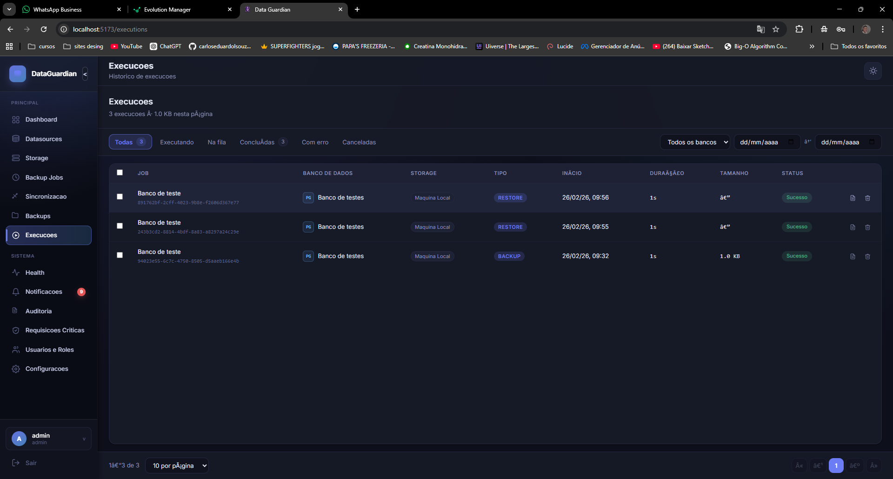
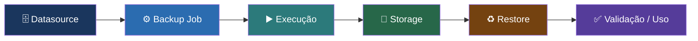

<div align="center">

<br/>

# 🛡️ DataGuardian

### Pare de torcer para que seus backups funcionem. Tenha a certeza de que funcionam.

*Backup e Restore de bancos de dados com foco em continuidade operacional.*
*Menos risco. Menos tempo de resposta. Mais confiabilidade.*

<br/>

[](https://docs.docker.com/compose/)
[](.)
[](.)
[](.)
[](./LICENSE)

<br/>

**[⬇️ Baixar pacote de instalação](#-download--instalação)** &nbsp;·&nbsp;
**[🖥️ Ver a interface](#-interface-simples-do-primeiro-clique-ao-restore)** &nbsp;·&nbsp;
**[🚀 Como fazer deploy](#-deploy-em-produção)**

<br/>

</div>

---

## 📋 Sumário

- [⬇️ Download & Instalação](#-download--instalação)
- [🖥️ Interface intuitiva](#-interface-simples-do-primeiro-clique-ao-restore)
- [💡 Por que usar o DataGuardian?](#-por-que-usar-o-dataguardian)
- [🎯 Onde ajuda no dia a dia](#-onde-ajuda-no-dia-a-dia)
- [🔄 Fluxo visual da operação](#-fluxo-visual-da-operação)
- [🚀 Deploy em produção](#-deploy-em-produção)
- [✅ Resultado esperado](#-resultado-esperado-após-o-deploy)
- [🔒 Boas práticas](#-boas-práticas-recomendadas)

---

## ⬇️ Download & Instalação

> Não precisa clonar o repositório. Basta baixar o pacote abaixo, configurar e subir com Docker.

<div align="center">

### 🟢 Versão Estável — Pronta para Produção

[](https://github.com/carloseduardolsouza/DataGuardian/releases/latest/download/dataguardian-deploy.zip)
[](https://github.com/carloseduardolsouza/DataGuardian/releases/latest)

</div>

O pacote contém tudo que você precisa:

```
dataguardian-deploy.zip
├── 📄 docker-compose.yml   ← orquestra todos os serviços
└── 📄 .env.example         ← modelo de configuração do ambiente
```

> Após baixar, siga o [guia de deploy](#-deploy-em-produção) abaixo. São apenas 4 passos.

---

## 🖥️ Interface simples — do primeiro clique ao restore

> Esqueça ferramentas complexas, scripts manuais e documentação desatualizada.
> O DataGuardian foi projetado para que **qualquer pessoa do time** consiga operar com segurança — sem precisar de treinamento técnico avançado.

<br/>

### 📊 Dashboard — visão completa em um único painel

Acompanhe o status de todos os seus bancos, jobs e execuções em tempo real, direto no navegador.

<div align="center">
  
</div>

<br/>

---

### 🗄️ Datasources — conecte seus bancos em segundos

Cadastre e gerencie múltiplas fontes de dados com um formulário simples. Sem editar arquivos de configuração, sem linha de comando.

<div align="center">
  
</div>

<br/>

---

### 💾 Backups — configure uma vez, funciona para sempre

Crie rotinas de backup com poucos cliques. Defina frequência, retenção e destino — a plataforma cuida do resto.

<div align="center">
  
</div>

<br/>

---

### ▶️ Execuções — histórico completo e rastreável

Veja exatamente o que aconteceu, quando aconteceu e quem acionou. Cada execução registrada com status, duração e log detalhado.

<div align="center">
  
</div>

<br/>

> 💬 **"Ficou tão simples que qualquer pessoa do time consegue fazer um restore sem precisar chamar o DBA."**

---

## 💡 Por que usar o DataGuardian?

> Em produção, **não é uma questão de "se" algo vai falhar — é uma questão de "quando"**.
> O DataGuardian garante que quando isso acontecer, você estará preparado.

<table>
  <tr>
    <td width="33%" valign="top">

### 🔴 Reduz risco de perda de dados
- Backups recorrentes com controle de execução
- Restore guiado com confirmação forte para operações críticas
- Histórico auditável para rastrear quem fez o quê e quando

    </td>
    <td width="33%" valign="top">

### ⚡ Diminui o tempo de recuperação
- Restauração por fluxo operacional simples e documentado
- Health checks e alertas para antecipar falhas antes do impacto
- Visão central de todas as execuções e status em tempo real

    </td>
    <td width="33%" valign="top">

### 🏛️ Cria governança real
- Permissões granulares por função (RBAC)
- Aprovação obrigatória em ações sensíveis e irreversíveis
- Auditoria completa para compliance e rastreabilidade

    </td>
  </tr>
</table>

---

## 🎯 Onde ajuda no dia a dia

| Cenário | 😰 Dor comum | ✅ Como o DataGuardian resolve |
|:---|:---|:---|
| **👷 Time de Operações** | Backups "manuais" e inconsistentes | Agenda, executa e registra tudo automaticamente |
| **🚨 Incidente em Produção** | Restore demorado, sem padrão e estressante | Fluxo guiado com validações passo a passo |
| **🔐 Segurança/Compliance** | Falta de trilha de auditoria | Logs detalhados e auditoria por ação do usuário |
| **📈 Escala de ambiente** | Gestão dispersa de múltiplos bancos | Painel único de controle centralizado |

---

## 🔄 Fluxo visual da operação



---

## 🚀 Deploy em produção

> **Objetivo:** subir o sistema completo em minutos, apenas com o pacote de deploy.

### 📦 Pré-requisitos

- ✅ [Docker](https://docs.docker.com/get-docker/) instalado
- ✅ [Docker Compose](https://docs.docker.com/compose/install/) instalado
- ✅ Pacote `.zip` baixado ([baixar aqui](#-download--instalação))

---

### Passo 1 — 📂 Extrair o pacote

Extraia o `.zip` em um diretório do seu servidor:

```bash
# Linux / macOS
unzip dataguardian-deploy.zip -d /opt/dataguardian
cd /opt/dataguardian
```

```powershell
# Windows (PowerShell)
Expand-Archive dataguardian-deploy.zip -DestinationPath C:\dataguardian
cd C:\dataguardian
```

---

### Passo 2 — ⚙️ Configurar o `.env`

```bash
cp .env.example .env
```

Edite o `.env` com as configurações do seu ambiente:

| Variável | Descrição | Obrigatório |
|:---|:---|:---:|
| `DATABASE_URL` | String de conexão do banco de dados principal | ✅ |
| `REDIS_URL` | URL de conexão do Redis | ✅ |
| `REDIS_PASSWORD` | Senha do Redis | ⚠️ |
| `PORT` | Porta da aplicação | ✅ |
| `HOST` | Host/IP da aplicação | ✅ |
| `ALLOWED_ORIGINS` | Origens permitidas (CORS) | ✅ |

> ⚠️ **Nunca** compartilhe ou commite seu arquivo `.env` com credenciais reais.

---

### Passo 3 — ▶️ Subir o ambiente

```bash
docker compose up -d
```

Aguarde os containers iniciarem. Para acompanhar os logs:

```bash
docker compose logs -f
```

---

### Passo 4 — ✅ Validar o deploy

Abra a aplicação no navegador:

```
http://SEU_HOST:PORT
```

Verifique o endpoint de saúde:

```bash
curl http://SEU_HOST:PORT/health
# Resposta esperada: {"status":"ok"}
```

---

## ✅ Resultado esperado após o deploy

Ao final do processo, você terá:

- 🖥️ **Painel central** acessível via navegador com visão completa do ambiente
- ⏱️ **Rotinas de backup** automatizadas e prontas para configuração
- 👥 **Controle de acesso** granular por usuário, função e permissão
- 🛡️ **Base sólida** para sua estratégia de recuperação de desastre
- 📊 **Métricas e health checks** para monitoramento contínuo

---

## 🔒 Boas práticas recomendadas

<details>
  <summary><strong>🔍 Ver boas práticas de segurança e operação</strong></summary>

<br/>

| 🔧 Prática | 📝 Descrição |
|:---|:---|
| **🔒 HTTPS obrigatório** | Use reverse proxy (nginx/traefik) com TLS válido em produção |
| **🌐 Isolamento de rede** | Restrinja acesso de rede aos serviços internos via firewall |
| **🔑 Gestão de credenciais** | Proteja o `.env` e prefira gerenciadores de segredos (Vault, etc.) |
| **🧪 Teste de restore** | Valide periodicamente a integridade dos backups com restores reais |
| **📡 Monitoramento ativo** | Acompanhe métricas e o health endpoint com alertas configurados |
| **🔄 Rotação de credenciais** | Altere senhas e tokens de acesso periodicamente |

</details>

---

<div align="center">

<br/>

### 🛡️ Pronto para proteger seus dados?

**[⬇️ Baixar o DataGuardian agora](https://github.com/carloseduardolsouza/DataGuardian/releases/latest)**

<br/>

*DataGuardian transforma backup e restore em um processo **confiável**, **auditável** e **operacionalmente simples** para produção.*

<br/>

---

Feito com ❤️ para times que levam dados a sério.

<br/>

</div>
